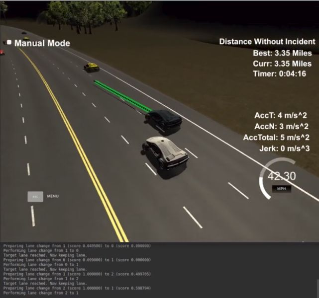

# CarND Path Planning

The goal of this project is to safely navigate around a virtual highway with other traffic that is driving
±10 MPH of the 50 MPH speed limit. You will be provided the car's localization and sensor fusion data and there is 
also a sparse map list of waypoints around the highway. 

* The car should try to go as close as possible to the 50 MPH speed limit, which means passing slower traffic when
  possible, note that other cars will try to change lanes too. 
* The car should avoid hitting other cars at all cost as well as driving inside of the marked road lanes at all times, 
  unless going from one lane to another. 
* The car should be able to make one complete loop around the 6946m highway. Since the car is trying to go 50 MPH, 
  it should take a little over 5 minutes to complete 1 loop. 
* Also, the car should not experience total acceleration over 10 m/s^2^ and jerk that is greater than 10 m/s^3^.

A video of the final implementation running in a simulator can be found [here](https://www.youtube.com/watch?v=3HQpzWqzZw0). 

<a href="https://www.youtube.com/watch?v=3HQpzWqzZw0"></a>

## The highway map (`data/highway_map.txt`)

Each waypoint in the list contains `[x, y, s, dx, dy]` values. 
`x` and `y` are the waypoint's map coordinate position, the `s` value is the distance along the road to get to that 
waypoint in meters, the `dx` and `dy` values define the unit normal vector pointing outward of the highway loop.

The highway's waypoints loop around so the Frenet `s` value - distance along the road - goes from `0` to `6945.554`.

## Basic Build Instructions

1. Clone this repo.
2. Make a build directory: `mkdir build && cd build`
3. Compile: `cmake .. && make`
4. Run it: `./path_planning`.

## Data provided from the Simulator to the C++ program

### Main car's localization data (noise-free)

- `["x"]`: The car's x position in map coordinates
- `["y"]`: The car's y position in map coordinates
- `["s"]`: The car's s position in frenet coordinates
- `["d"]`: The car's d position in frenet coordinates
- `["yaw"]`: The car's yaw angle in the map
- `["speed"]`: The car's speed in MPH

### Previous path data given to the Planner

//Note: Return the previous list but with processed points removed, can be a nice tool to show how far along
the path has processed since last time. 

- `["previous_path_x"]`: The previous list of x points previously given to the simulator
- `["previous_path_y"]`: The previous list of y points previously given to the simulator

### Previous path's end s and d values 

- `["end_path_s"]`: The previous list's last point's frenet s value
- `["end_path_d"]`: The previous list's last point's frenet d value

### Sensor Fusion Data, a list of all other car's attributes on the same side of the road. (No Noise)

- `["sensor_fusion"]`: A 2d vector of cars and then that car's [car's unique ID, car's `x` position in map coordinates, 
                       car's `y` position in map coordinates, car's `x` velocity in m/s, car's `y` velocity in m/s, 
                       car's `s` position in Frenet coordinates, car's `d` position in Frenet coordinates. 

## Details

1. The car uses a perfect controller and will visit every `(x,y)` point it receives in the list every `.02` seconds. 
   The units for the `(x,y)` points are in meters and the spacing of the points determines the speed of the car. 
   The vector going from a point to the next point in the list dictates the angle of the car. 
   Acceleration both in the tangential and normal directions is measured along with the jerk, the rate of change of 
   total acceleration. The `(x,y)` point paths that the planner receives should not have a total acceleration that goes 
   over 10 m/s^2, also the jerk should not go over 50 m/s^3. 
   (NOTE: As this is BETA, these requirements might change. Also currently jerk is over a .02 second interval, it
          would probably be better to average total acceleration over 1 second and measure jerk from that.)

2. There will be some latency between the simulator running and the path planner returning a path, with optimized code
   usually its not very long maybe just 1-3 time steps. During this delay the simulator will continue using points that
   it was last given, because of this its a good idea to store the last points you have used so you can have a smooth
   transition. previous_path_x, and previous_path_y can be helpful for this transition since they show the last points
   given to the simulator controller with the processed points already removed. You would either return a path that
   extends this previous path or make sure to create a new path that has a smooth transition with this last path.

## Tips

A really helpful resource for doing this project and creating smooth trajectories was using 
http://kluge.in-chemnitz.de/opensource/spline/, the spline function is in a single header file is really easy to use.

---

## Dependencies

* cmake >= 3.5
  * All OSes: [click here for installation instructions](https://cmake.org/install/)
* make >= 4.1
  * Linux: make is installed by default on most Linux distros
  * Mac: [install Xcode command line tools to get make](https://developer.apple.com/xcode/features/)
  * Windows: [Click here for installation instructions](http://gnuwin32.sourceforge.net/packages/make.htm)
* gcc/g++ >= 5.4
  * Linux: gcc / g++ is installed by default on most Linux distros
  * Mac: same deal as make - [install Xcode command line tools]((https://developer.apple.com/xcode/features/)
  * Windows: recommend using [MinGW](http://www.mingw.org/)
* [uWebSockets](https://github.com/uWebSockets/uWebSockets)
  * Run either `install-mac.sh` or `install-ubuntu.sh`.
  * If you install from source, checkout to commit `e94b6e1`, i.e.
    ```
    git clone https://github.com/uWebSockets/uWebSockets 
    cd uWebSockets
    git checkout e94b6e1
    ```

## Path Generation

Note that this project's code was inspired by and extended from the work of both [Yangchun Luo](https://github.com/yangchunluo/udacity-self-driving-p11-path-planning) 
and GitHub user [plizanabesa](https://github.com/plizanabesa/CarND-Path-Planning-Project), both of which I used
as a reference point.

The code is distributed into several modules:

- The main (websocket handling) logic in `main.cpp`,
- The environmental context in `EnvContext.h`,
- Sensory data in `SensorData.h`,
- Vehicle tracking information in `TrackedVehicle.h`,
- Lane utilization information in `LaneInfo.h`,
- Trajectory information in `Trajectory.h`,
- Map data in `Map.h`/`.cpp`,

as well as

- Action cost evaluation in `CostFunction.h`/`.cpp`, and the
- Path planning state machine in `Planner.h`/`.cpp`.

In general, sensory data is obtained from the websocket, interpreted according to the current environment context,
separated by lanes, evaluated according to a collection of cost functions considering the current ("ego") car's 
state, and reduced to an action, which is then translated into a spline-smoothed trajectory to be sent back
over the websocket. The core of this can be found in the `Planner::planPath()` method.

### Obtaining lane data

Initially, the sensed vehicles are related to their corresponding lanes and split into "front" and "rear" vectors 
within each lane. These are then sorted according to relative clearance (i.e. the difference in `s` value between
ego and the tracked vehicle).
A dummy entry is created at `NaN` clearance and with `max()` or `0` speed in the front and rear vectors respectively;
this is to ensure that a query of `.at(0)` always succeeds with a usable result.

### Deciding a successor state

The state machine implements the `KeepLane`, `PrepareLaneChange` and `ChangeLane` states. Valid state changes are:
- `KeepLane` to `PrepareLaneChange`,
- `PrepareLaneChange` to `KeepLane`,
- `PrepareLaneChange` to `ChangeLane`,
- `ChangeLane` to `KeepLane`.

Right now, the `PrepareLaneChange` state does not contain any useful logic and directly skips to `ChangeLane,` but 
would be a candidate to indicate lane changing intention, adjusting speed, generating a trajectory for changing, etc.

Within `KeepLane`, all lanes are constantly evaluated for the need and opportunity to change.
Evaluation is done eagerly so as to allow early lane changing: A slow at medium distance would still require a
lane change, so it does make sense to do it as early as possible - although, arguably, there should be some distance
limit for this decision.
If lane changes in the simulator appear to be unmotivated, this is the reason. :)

For evaluation of lanes, multiple cost functions are at play. All are taking into account the distance of a lane from 
the current lane, distance (i.e. clearance) of vehicle in front of and behind ego, and number of vehicles in front 
of ego in a given lane. Each cost function issues a value in range `0..1`, where `0` is no cost (i.e. "for free") 
and `1` is the highest possible value ("forbidden"):

- `FrontClearanceTooLowCost` issues a lower cost with increasing clearance in a given lane front of ego,
  taking maximum value whenever the clearance falls below a lower threshold. This is to make sure that we can
  never switch to a lane where a car would be too close, and prefer selecting lanes with a high clearance in
  front of us.
- `RearClearanceTooLowCost` works similar to `FrontClearanceTooLowCost`, but only looks behind the ego car;
  the reasoning here is that we want to avoid changing to a lane where we could interfere with cars driving behind of
  us. Ideally, this cost function would predict the position of the trailing car some seconds in the future,
  taking its relative velocity into account.
- `TrackedVehiclesInFrontCost` issues a cost relative to the number of vehicles in front of ego on a given lane.
  This is to ensure we're preferring lanes with fewer cars, as this will also reduce the possibility of a traffic jam
  in the selected lane.
- `LaneVelocityCost` issues cost anti-proportional to the velocity of the closest tracked vehicle in front of ego
  in the select lane.
  Even if a lane contained exactly one vehicle far away from us, we would still have to switch lanes again soon if that
  vehicle has a negative relative velocity.
  Ideally, this cost function would take into account the velocities of _all_ vehicles on the lane (in front of us),
  since the closest vehicle might be accelerating and decelerating due to a single slow vehicle before it;
  this is actually an issue in the simulator and will result in bad judgement on our behalf.
- `BaseLaneCost` biases the vehicle towards the center lane by issuing a higher cost for all off-center lanes.
  Since the center lane allows to steer both to the left and right, it should always be preferred over a border lane.
- `SideClearanceTooLowCost` functions as a safety measure that issues maximum cost whenever a car is right next to
  us; this way, we are prevented from switching lanes when we would drive right into another vehicle, regardless
  of the other functions. Technically this should be captured by the front and rear clearance measures; however, these
  functions consider only a specific lane, and not the lane in between ego and the one being evaluated 
  (e.g. when ego is on lane `0`,  but we are evaluating lane `2`).
- `SkipOneLaneCost` issues maximum cost for all lanes that are more than one hop away. This effectively makes
  `SideClearanceTooLowCost` superfluous, but it makes the intention unambiguous.

The `LaneCostEvaluation` meta-function evaluates all previous functions and yields the maximum individual cost.
I was thinking of combining the values as probabilities or confidences, selecting the lane with the maximum posterior,
but ended up going with a simpler approach. Going with probabilities would also
allow for conditioning lanes further away on the lanes in between; specifically, we should only be allowed to reach
lane `2` from lane `0`, if lane `1` does not have a high probability for colliding (read: a low probability 
of being selected itself).

If a lane is yielding a lower cost than the currently selected one, a state change to `PrepareLaneChange` (and from
there, `ChangeLane`) is issued. If the current lane is the one with the lowest cost, the state `KeepLane` will be
kept, as will be when the cost for all lanes is maximal.

Regardless of the state, the speed will be adjusted for the car right in front of ego. Although this is inefficient when
changing lanes as it might affect rear vehicles, the `RearClearanceTooLowCost` cost function will bias towards
lanes where rear vehicles are further away to begin with. Ideally, the target velocity is interpolated between the
current and target lane and will be adjusted according to the surroundings.

### Trajectory generation

As described in the project material, `(x,y)` keypoints are generated at equally spaced positions 30 meters apart.
These are then spline interpolated for a smooth path, with the number of steps being anti-proportional to the 
target velocity (i.e. more points for lower speeds).


## Points for improvement

As already discussed, the cost functions could be improved to take predicted future behavior of the tracked vehicles
into account. Also, since the behavior of other drivers is generally stochastic, the functions should be reasoning
over probability distributions, such as likely positions, etc.
The "event horizon" of the sensors is a problem in some cases: If decisions are taken verbatim e.g. based on the number
of vehicles in the lane and a new vehicle "suddenly" appears, this can result in seemingly erratic behavior such as
switching a lane, then switching back.
Following from the, the output of a the cost functions should be a probability distribution as well. Integrating the
probabilities over a small time window (e.g. in the `PrepareLaneChange` state) could improve decisions by ensuring
that only strong signals are taken into account. To name an example: Some simulated vehicles accelerate to their
preferred speed, then brake if they can't reach it due to an obstacle. This results in an observed velocity wave
pattern that interferes with "hard" decision making.
The spline interpolation could be a lot smoother, and more refined plans could be created than just changing lanes
ad hoc. In some cases, braking in order to become lower than a car next to us could allow for lane changes across two
lanes that would eventually be better; without this kind of reasoning, the car might be stuck in between two
slow drivers (front and side).

In general, this is a very interesting project with a lot of potential for experiments and smart designs.
